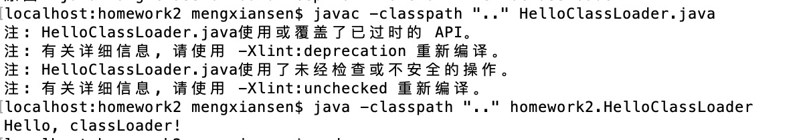
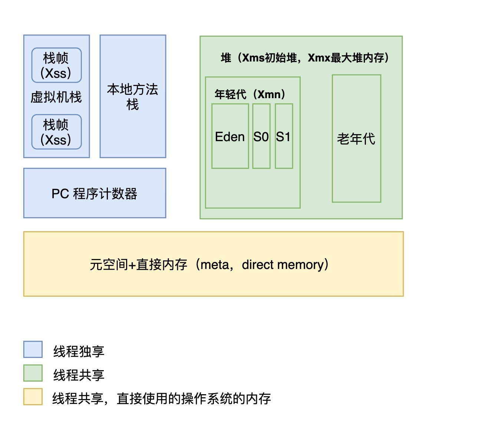

# 第一课 作业

## 1. （可选）自己写一个简单的Hello.java，里面需要涉及基本类型，四则运算，if 和 for，然后自己分析一下对应的字节码，有问题群里讨论

源码

[Hello.java](src/homework1/Hello.java)

字节码

```bash
# 生成 Hello.class
javac Hello.java
# 生成字节码
javap -c -v Hello.class
```

[HelloClassCode.md](src/homework1/HelloClassCode.md)

## 2. （必做）自定义一个 Classloader，加载一个Hello.xlass 文件，执行 hello 方法，此文件内容是一个 Hello.class 文件所有字节（x=255-x）处理后的文件。

[HelloClassLoader.java](src/homework2/HelloClassLoader.java)

```bash
cd src/homework2
# 编译
javac -classpath ".." HelloClassLoader.java 
# 执行
java -classpath ".." homework2.HelloClassLoader
# 输出 Hello, classLoader!
```



## 3. （必做）画一张图，展示 Xmx、Xms、Xmn、Meta、DirectMemory、Xss 这些内存参数的关系

Xmx : 堆的最大可用内存大小

Xms：堆的初始内存大小

Xmn：年轻代大小

meta：元空间大小

directmemory：直接内存

内存模型




## 4. （可选）检查一下自己维护的业务系统的 JVM参数配置，用 jstat 和 jstack、jmap 查看一下详情，并且自己独立分析一下大概情况，思考有没有不合理的地方，如何改进。（注意：1.对于线上有流量的系统，慎重使用jmap命令。2.如果没有线上系统，可以自己run一个web/java 项目。或者直接查看idea进程）

* idea 运行一个死锁的 java 进程 [JStackTest.java](src/homework4/JStackTest.java)

```bash
/Library/Java/JavaVirtualMachines/jdk1.8.0_05.jdk/Contents/Home/bin/java -Xmx700m -Djava.awt.headless=true -Djava.endorsed.dirs="" -Djdt.compiler.useSingleThread=true -Dpreload.project.path=/Users/mengxiansen/job/study/geekuniversity/java/git/JAVA-01 -Dpreload.config.path=/Users/mengxiansen/Library/Preferences/IdeaIC2019.1/options -Dcompile.parallel=false -Drebuild.on.dependency.change=true -Djava.net.preferIPv4Stack=true -Dio.netty.initialSeedUniquifier=6449342257502816875 -Dfile.encoding=UTF-8 -Duser.language=zh -Duser.country=CN -Didea.paths.selector=IdeaIC2019.1 -Didea.home.path=/Applications/IntelliJ IDEA CE.app/Contents -Didea.config.path=/Users/mengxiansen/Library/Preferences/IdeaIC2019.1 -Didea.plugins.path=/Users/mengxiansen/Library/Application Support/IdeaIC2019.1 -Djps.log.dir=/Users/mengxiansen/Library/Logs/IdeaIC2019.1/build-log -Djps.fallback.jdk.home=/Applications/IntelliJ IDEA CE.app/Contents/jdk/Contents/Home/jre -Djps.fallback.jdk.version=1.8.0_202-release -Dio.netty.noUnsafe=true -Djava.io.tmpdir=/Users/mengxiansen/Library/Caches/IdeaIC2019.1/compile-server/java-01_2f156a05/_temp_ -Djps.backward.ref.index.builder=true -Dkotlin.incremental.compilation=true -Dkotlin.incremental.compilation.js=true -Dkotlin.daemon.enabled -Dkotlin.daemon.client.alive.path="/var/folders/kf/lxnx5gvj4fz_v94_9xvcgf740000gn/T/kotlin-idea-1149289883136207071-is-running" -classpath /Applications/IntelliJ IDEA CE.app/Contents/lib/jps-launcher.jar:/Library/Java/JavaVirtualMachines/jdk1.8.0_05.jdk/Contents/Home/lib/tools.jar org.jetbrains.jps.cmdline.Launcher /Applications/IntelliJ IDEA CE.app/Contents/lib/util.jar:/Applications/IntelliJ IDEA CE.app/Contents/lib/jna-platform.jar:/Applications/IntelliJ IDEA CE.app/Contents/lib/netty-common-4.1.32.Final.jar:/Applications/IntelliJ IDEA CE.app/Contents/lib/maven-aether-provider-3.3.9.jar:/Applications/IntelliJ IDEA CE.app/Contents/lib/maven-builder-support-3.3.9.jar:/Applications/IntelliJ IDEA CE.app/Contents/lib/aether-util-1.1.0.jar:/Applications/IntelliJ IDEA CE.app/Contents/lib/log4j.jar:/Applications/IntelliJ IDEA CE.app/Contents/lib/lz4-1.3.0.jar:/Applications/IntelliJ IDEA CE.app/Contents/lib/maven-model-builder-3.3.9.jar:/Applications/IntelliJ IDEA CE.app/Contents/lib/asm-all-7.0.jar:/Applications/IntelliJ IDEA CE.app/Contents/lib/commons-codec-1.10.jar:/Applications/IntelliJ IDEA CE.app/Contents/lib/netty-resolver-4.1.32.Final.jar:/Applications/IntelliJ IDEA CE.app/Contents/lib/nanoxml-2.2.3.jar:/Applications/IntelliJ IDEA CE.app/Contents/lib/protobuf-java-3.5.1.jar:/Applications/IntelliJ IDEA CE.app/Contents/lib/maven-repository-metadata-3.3.9.jar:/Applications/IntelliJ IDEA CE.app/Contents/lib/netty-transport-4.1.32.Final.jar:/Applications/IntelliJ IDEA CE.app/Contents/lib/aether-transport-file-1.1.0.jar:/Applications/IntelliJ IDEA CE.app/Contents/lib/trove4j.jar:/Applications/IntelliJ IDEA CE.app/Contents/lib/plexus-utils-3.0.22.jar:/Applications/IntelliJ IDEA CE.app/Contents/lib/httpcore-4.4.10.jar:/Applications/IntelliJ IDEA CE.app/Contents/lib/jps-builders.jar:/Applications/IntelliJ IDEA CE.app/Contents/lib/jna.jar:/Applications/IntelliJ IDEA CE.app/Contents/lib/plexus-component-annotations-1.6.jar:/Applications/IntelliJ IDEA CE.app/Contents/lib/aether-dependency-resolver.jar:/Applications/IntelliJ IDEA CE.app/Contents/lib/guava-25.1-jre.jar:/Applications/IntelliJ IDEA CE.app/Contents/lib/maven-artifact-3.3.9.jar:/Applications/IntelliJ IDEA CE.app/Contents/lib/aether-api-1.1.0.jar:/Applications/IntelliJ IDEA CE.app/Contents/lib/commons-lang3-3.4.jar:/Applications/IntelliJ IDEA CE.app/Contents/lib/maven-model-3.3.9.jar:/Applications/IntelliJ IDEA CE.app/Contents/lib/netty-buffer-4.1.32.Final.jar:/Applications/IntelliJ IDEA CE.app/Contents/lib/aether-impl-1.1.0.jar:/Applications/IntelliJ IDEA CE.app/Contents/lib/httpclient-4.5.6.jar:/Applications/IntelliJ IDEA CE.app/Contents/lib/idea_rt.jar:/Applications/IntelliJ IDEA CE.app/Contents/lib/resources_en.jar:/Applications/IntelliJ IDEA CE.app/Contents/lib/plexus-interpolation-1.21.jar:/Applications/IntelliJ IDEA CE.app/Contents/lib/oro-2.0.8.jar:/Applications/IntelliJ IDEA CE.app/Contents/lib/jps-model.jar:/Applications/IntelliJ IDEA CE.app/Contents/lib/aether-transport-http-1.1.0.jar:/Applications/IntelliJ IDEA CE.app/Contents/lib/aether-connector-basic-1.1.0.jar:/Applications/IntelliJ IDEA CE.app/Contents/lib/netty-codec-4.1.32.Final.jar:/Applications/IntelliJ IDEA CE.app/Contents/lib/platform-api.jar:/Applications/IntelliJ IDEA CE.app/Contents/lib/forms-1.1-preview.jar:/Applications/IntelliJ IDEA CE.app/Contents/lib/slf4j-api-1.7.25.jar:/Applications/IntelliJ IDEA CE.app/Contents/lib/jps-builders-6.jar:/Applications/IntelliJ IDEA CE.app/Contents/lib/jdom.jar:/Applications/IntelliJ IDEA CE.app/Contents/lib/aether-spi-1.1.0.jar:/Applications/IntelliJ IDEA CE.app/Contents/lib/annotations.jar:/Applications/IntelliJ IDEA CE.app/Contents/lib/commons-logging-1.2.jar:/Applications/IntelliJ IDEA CE.app/Contents/lib/javac2.jar:/Applications/IntelliJ IDEA CE.app/Contents/lib/gson-2.8.5.jar:/Applications/IntelliJ IDEA CE.app/Contents/plugins/android/lib/jarutils.jar:/Applications/IntelliJ IDEA CE.app/Contents/lib/guava-25.1-jre.jar:/Applications/IntelliJ IDEA CE.app/Contents/plugins/android/lib/common-26.3.0.jar:/Applications/IntelliJ IDEA CE.app/Contents/plugins/gradle/lib/gradle-api-4.10.3.jar:/Applications/IntelliJ IDEA CE.app/Contents/lib/gson-2.8.5.jar:/Applications/IntelliJ IDEA CE.app/Contents/plugins/android/lib/jarutils.jar:/Applications/IntelliJ IDEA CE.app/Contents/lib/guava-25.1-jre.jar:/Applications/IntelliJ IDEA CE.app/Contents/plugins/android/lib/common-26.3.0.jar:/Applications/IntelliJ IDEA CE.app/Contents/plugins/gradle/lib/gradle-api-4.10.3.jar:/Applications/IntelliJ IDEA CE.app/Contents/plugins/ant/lib/ant-jps-plugin.jar:/Applications/IntelliJ IDEA CE.app/Contents/plugins/uiDesigner/lib/jps/ui-designer-jps-plugin.jar:/Applications/IntelliJ IDEA CE.app/Contents/plugins/IntelliLang/lib/intellilang-jps-plugin.jar:/Applications/IntelliJ IDEA CE.app/Contents/plugins/Groovy/lib/groovy-jps-plugin.jar:/Applications/IntelliJ IDEA CE.app/Contents/plugins/Groovy/lib/groovy-rt-constants.jar:/Applications/IntelliJ IDEA CE.app/Contents/plugins/eclipse/lib/eclipse-jps-plugin.jar:/Applications/IntelliJ IDEA CE.app/Contents/plugins/eclipse/lib/common-eclipse-util.jar:/Applications/IntelliJ IDEA CE.app/Contents/plugins/maven/lib/maven-jps-plugin.jar:/Applications/IntelliJ IDEA CE.app/Contents/plugins/gradle/lib/gradle-jps-plugin.jar:/Applications/IntelliJ IDEA CE.app/Contents/plugins/devkit/lib/devkit-jps-plugin.jar:/Applications/IntelliJ IDEA CE.app/Contents/plugins/Kotlin/lib/jps/kotlin-jps-plugin.jar:/Applications/IntelliJ IDEA CE.app/Contents/plugins/Kotlin/lib/kotlin-stdlib.jar:/Applications/IntelliJ IDEA CE.app/Contents/plugins/Kotlin/lib/kotlin-reflect.jar:/Applications/IntelliJ IDEA CE.app/Contents/plugins/Kotlin/lib/kotlin-plugin.jar:/Applications/IntelliJ IDEA CE.app/Contents/plugins/android/lib/jps/android-jps-plugin.jar:/Applications/IntelliJ IDEA CE.app/Contents/plugins/android/lib/android-common.jar:/Applications/IntelliJ IDEA CE.app/Contents/plugins/android/lib/build-common.jar:/Applications/IntelliJ IDEA CE.app/Contents/plugins/android/lib/android-rt.jar:/Applications/IntelliJ IDEA CE.app/Contents/plugins/android/lib/android-extensions-ide.jar:/Applications/IntelliJ IDEA CE.app/Contents/plugins/android/lib/sdk-common-26.3.0.jar:/Applications/IntelliJ IDEA CE.app/Contents/plugins/android/lib/common-26.3.0.jar:/Applications/IntelliJ IDEA CE.app/Contents/plugins/android/lib/repository-26.3.0.jar:/Applications/IntelliJ IDEA CE.app/Contents/plugins/android/lib/sdklib-26.3.0.jar:/Applications/IntelliJ IDEA CE.app/Contents/plugins/android/lib/jarutils.jar:/Applications/IntelliJ IDEA CE.app/Contents/plugins/android/lib/layoutlib-api-26.3.0.jar:/Applications/IntelliJ IDEA CE.app/Contents/plugins/android/lib/manifest-merger-26.3.0.jar:/Applications/IntelliJ IDEA CE.app/Contents/plugins/javaFX/lib/javaFX-jps-plugin.jar:/Applications/IntelliJ IDEA CE.app/Contents/plugins/javaFX/lib/common-javaFX-plugin.jar org.jetbrains.jps.cmdline.BuildMain 127.0.0.1 54745 2ed9f0dc-3a1c-413a-9b7f-590d7e9acb07 /Users/mengxiansen/Library/Caches/IdeaIC2019.1/compile-server
```

* jmap 查看idea 的内存使用情况

```java
 jmap -heap 33778
Attaching to process ID 33778, please wait...
Debugger attached successfully.
Server compiler detected.
JVM version is 25.5-b02

using thread-local object allocation.
Parallel GC with 8 thread(s)

Heap Configuration:
   MinHeapFreeRatio         = 40
   MaxHeapFreeRatio         = 70
   MaxHeapSize              = 734003200 (700.0MB)
   NewSize                  = 1572864 (1.5MB)
   MaxNewSize               = 244318208 (233.0MB)
   OldSize                  = 266862592 (254.5MB)
   NewRatio                 = 2
   SurvivorRatio            = 8
   MetaspaceSize            = 21807104 (20.796875MB)
   CompressedClassSpaceSize = 1073741824 (1024.0MB)
   MaxMetaspaceSize         = 17592186044415 MB
   G1HeapRegionSize         = 0 (0.0MB)

Heap Usage:
PS Young Generation
Eden Space:
   capacity = 20447232 (19.5MB)
   used     = 6954136 (6.631980895996094MB)
   free     = 13493096 (12.868019104003906MB)
   34.01015844100561% used
From Space:
   capacity = 2097152 (2.0MB)
   used     = 764800 (0.7293701171875MB)
   free     = 1332352 (1.2706298828125MB)
   36.468505859375% used
To Space:
   capacity = 2097152 (2.0MB)
   used     = 0 (0.0MB)
   free     = 2097152 (2.0MB)
   0.0% used
PS Old Generation
   capacity = 266862592 (254.5MB)
   used     = 20149160 (19.215736389160156MB)
   free     = 246713432 (235.28426361083984MB)
   7.550387579237783% used

3978 interned Strings occupying 318112 bytes.
```

* jstack 查看一个 idea 运行一个死锁的 java 进程 [JStackTest.java](src/homework4/JStackTest.java)

```java
jstack -l 33779
2021-01-11 00:14:27
Full thread dump Java HotSpot(TM) 64-Bit Server VM (25.5-b02 mixed mode):

"Attach Listener" #14 daemon prio=9 os_prio=31 tid=0x00007fb31380a000 nid=0xa703 waiting on condition [0x0000000000000000]
   java.lang.Thread.State: RUNNABLE

   Locked ownable synchronizers:
	- None

"DestroyJavaVM" #13 prio=5 os_prio=31 tid=0x00007fb316069000 nid=0x2603 waiting on condition [0x0000000000000000]
   java.lang.Thread.State: RUNNABLE

   Locked ownable synchronizers:
	- None

"t2" #12 prio=5 os_prio=31 tid=0x00007fb313808800 nid=0xa803 waiting on condition [0x000070000c2da000]
   java.lang.Thread.State: WAITING (parking)
	at sun.misc.Unsafe.park(Native Method)
	- parking to wait for  <0x000000076ac086b8> (a java.util.concurrent.locks.ReentrantLock$NonfairSync)
	at java.util.concurrent.locks.LockSupport.park(LockSupport.java:175)
	at java.util.concurrent.locks.AbstractQueuedSynchronizer.parkAndCheckInterrupt(AbstractQueuedSynchronizer.java:836)
	at java.util.concurrent.locks.AbstractQueuedSynchronizer.acquireQueued(AbstractQueuedSynchronizer.java:870)
	at java.util.concurrent.locks.AbstractQueuedSynchronizer.acquire(AbstractQueuedSynchronizer.java:1199)
	at java.util.concurrent.locks.ReentrantLock$NonfairSync.lock(ReentrantLock.java:209)
	at java.util.concurrent.locks.ReentrantLock.lock(ReentrantLock.java:285)
	at homework4.JStackTest.doSomething(JStackTest.java:38)
	at homework4.JStackTest.run(JStackTest.java:16)

   Locked ownable synchronizers:
	- <0x000000076ac18178> (a java.util.concurrent.locks.ReentrantLock$NonfairSync)

"t1" #11 prio=5 os_prio=31 tid=0x00007fb31405a800 nid=0x5603 waiting on condition [0x000070000c1d7000]
   java.lang.Thread.State: WAITING (parking)
	at sun.misc.Unsafe.park(Native Method)
	- parking to wait for  <0x000000076ac18178> (a java.util.concurrent.locks.ReentrantLock$NonfairSync)
	at java.util.concurrent.locks.LockSupport.park(LockSupport.java:175)
	at java.util.concurrent.locks.AbstractQueuedSynchronizer.parkAndCheckInterrupt(AbstractQueuedSynchronizer.java:836)
	at java.util.concurrent.locks.AbstractQueuedSynchronizer.acquireQueued(AbstractQueuedSynchronizer.java:870)
	at java.util.concurrent.locks.AbstractQueuedSynchronizer.acquire(AbstractQueuedSynchronizer.java:1199)
	at java.util.concurrent.locks.ReentrantLock$NonfairSync.lock(ReentrantLock.java:209)
	at java.util.concurrent.locks.ReentrantLock.lock(ReentrantLock.java:285)
	at homework4.JStackTest.doSomething(JStackTest.java:25)
	at homework4.JStackTest.run(JStackTest.java:16)

   Locked ownable synchronizers:
	- <0x000000076ac086b8> (a java.util.concurrent.locks.ReentrantLock$NonfairSync)

"Service Thread" #10 daemon prio=9 os_prio=31 tid=0x00007fb315882000 nid=0x3a03 runnable [0x0000000000000000]
   java.lang.Thread.State: RUNNABLE

   Locked ownable synchronizers:
	- None

"C1 CompilerThread3" #9 daemon prio=9 os_prio=31 tid=0x00007fb317801000 nid=0x3803 waiting on condition [0x0000000000000000]
   java.lang.Thread.State: RUNNABLE

   Locked ownable synchronizers:
	- None

"C2 CompilerThread2" #8 daemon prio=9 os_prio=31 tid=0x00007fb315881800 nid=0x3d03 waiting on condition [0x0000000000000000]
   java.lang.Thread.State: RUNNABLE

   Locked ownable synchronizers:
	- None

"C2 CompilerThread1" #7 daemon prio=9 os_prio=31 tid=0x00007fb31404a800 nid=0x3f03 waiting on condition [0x0000000000000000]
   java.lang.Thread.State: RUNNABLE

   Locked ownable synchronizers:
	- None

"C2 CompilerThread0" #6 daemon prio=9 os_prio=31 tid=0x00007fb314049800 nid=0x4003 waiting on condition [0x0000000000000000]
   java.lang.Thread.State: RUNNABLE

   Locked ownable synchronizers:
	- None

"Monitor Ctrl-Break" #5 daemon prio=5 os_prio=31 tid=0x00007fb31404f000 nid=0x4203 runnable [0x000070000bac2000]
   java.lang.Thread.State: RUNNABLE
	at java.net.SocketInputStream.socketRead0(Native Method)
	at java.net.SocketInputStream.read(SocketInputStream.java:150)
	at java.net.SocketInputStream.read(SocketInputStream.java:121)
	at sun.nio.cs.StreamDecoder.readBytes(StreamDecoder.java:284)
	at sun.nio.cs.StreamDecoder.implRead(StreamDecoder.java:326)
	at sun.nio.cs.StreamDecoder.read(StreamDecoder.java:178)
	- locked <0x000000076ac169c0> (a java.io.InputStreamReader)
	at java.io.InputStreamReader.read(InputStreamReader.java:184)
	at java.io.BufferedReader.fill(BufferedReader.java:161)
	at java.io.BufferedReader.readLine(BufferedReader.java:324)
	- locked <0x000000076ac169c0> (a java.io.InputStreamReader)
	at java.io.BufferedReader.readLine(BufferedReader.java:389)
	at com.intellij.rt.execution.application.AppMainV2$1.run(AppMainV2.java:64)

   Locked ownable synchronizers:
	- None

"Signal Dispatcher" #4 daemon prio=9 os_prio=31 tid=0x00007fb315835800 nid=0x3503 runnable [0x0000000000000000]
   java.lang.Thread.State: RUNNABLE

   Locked ownable synchronizers:
	- None

"Finalizer" #3 daemon prio=8 os_prio=31 tid=0x00007fb317008800 nid=0x4a03 in Object.wait() [0x000070000b8bc000]
   java.lang.Thread.State: WAITING (on object monitor)
	at java.lang.Object.wait(Native Method)
	- waiting on <0x000000076ac30180> (a java.lang.ref.ReferenceQueue$Lock)
	at java.lang.ref.ReferenceQueue.remove(ReferenceQueue.java:142)
	- locked <0x000000076ac30180> (a java.lang.ref.ReferenceQueue$Lock)
	at java.lang.ref.ReferenceQueue.remove(ReferenceQueue.java:158)
	at java.lang.ref.Finalizer$FinalizerThread.run(Finalizer.java:209)

   Locked ownable synchronizers:
	- None

"Reference Handler" #2 daemon prio=10 os_prio=31 tid=0x00007fb317800000 nid=0x4c03 in Object.wait() [0x000070000b7b9000]
   java.lang.Thread.State: WAITING (on object monitor)
	at java.lang.Object.wait(Native Method)
	- waiting on <0x000000076ac28480> (a java.lang.ref.Reference$Lock)
	at java.lang.Object.wait(Object.java:502)
	at java.lang.ref.Reference$ReferenceHandler.run(Reference.java:157)
	- locked <0x000000076ac28480> (a java.lang.ref.Reference$Lock)

   Locked ownable synchronizers:
	- None

"VM Thread" os_prio=31 tid=0x00007fb313800800 nid=0x4d03 runnable 

"GC task thread#0 (ParallelGC)" os_prio=31 tid=0x00007fb314810000 nid=0x1e07 runnable 

"GC task thread#1 (ParallelGC)" os_prio=31 tid=0x00007fb315802000 nid=0x2a03 runnable 

"GC task thread#2 (ParallelGC)" os_prio=31 tid=0x00007fb315803000 nid=0x5303 runnable 

"GC task thread#3 (ParallelGC)" os_prio=31 tid=0x00007fb316806000 nid=0x5203 runnable 

"GC task thread#4 (ParallelGC)" os_prio=31 tid=0x00007fb314810800 nid=0x5103 runnable 

"GC task thread#5 (ParallelGC)" os_prio=31 tid=0x00007fb314811000 nid=0x2e03 runnable 

"GC task thread#6 (ParallelGC)" os_prio=31 tid=0x00007fb314812000 nid=0x5003 runnable 

"GC task thread#7 (ParallelGC)" os_prio=31 tid=0x00007fb314002800 nid=0x3003 runnable 

"VM Periodic Task Thread" os_prio=31 tid=0x00007fb31404d000 nid=0x5503 waiting on condition 

JNI global references: 23


Found one Java-level deadlock:
=============================
"t2":
  waiting for ownable synchronizer 0x000000076ac086b8, (a java.util.concurrent.locks.ReentrantLock$NonfairSync),
  which is held by "t1"
"t1":
  waiting for ownable synchronizer 0x000000076ac18178, (a java.util.concurrent.locks.ReentrantLock$NonfairSync),
  which is held by "t2"

Java stack information for the threads listed above:
===================================================
"t2":
	at sun.misc.Unsafe.park(Native Method)
	- parking to wait for  <0x000000076ac086b8> (a java.util.concurrent.locks.ReentrantLock$NonfairSync)
	at java.util.concurrent.locks.LockSupport.park(LockSupport.java:175)
	at java.util.concurrent.locks.AbstractQueuedSynchronizer.parkAndCheckInterrupt(AbstractQueuedSynchronizer.java:836)
	at java.util.concurrent.locks.AbstractQueuedSynchronizer.acquireQueued(AbstractQueuedSynchronizer.java:870)
	at java.util.concurrent.locks.AbstractQueuedSynchronizer.acquire(AbstractQueuedSynchronizer.java:1199)
	at java.util.concurrent.locks.ReentrantLock$NonfairSync.lock(ReentrantLock.java:209)
	at java.util.concurrent.locks.ReentrantLock.lock(ReentrantLock.java:285)
	at homework4.JStackTest.doSomething(JStackTest.java:38)
	at homework4.JStackTest.run(JStackTest.java:16)
"t1":
	at sun.misc.Unsafe.park(Native Method)
	- parking to wait for  <0x000000076ac18178> (a java.util.concurrent.locks.ReentrantLock$NonfairSync)
	at java.util.concurrent.locks.LockSupport.park(LockSupport.java:175)
	at java.util.concurrent.locks.AbstractQueuedSynchronizer.parkAndCheckInterrupt(AbstractQueuedSynchronizer.java:836)
	at java.util.concurrent.locks.AbstractQueuedSynchronizer.acquireQueued(AbstractQueuedSynchronizer.java:870)
	at java.util.concurrent.locks.AbstractQueuedSynchronizer.acquire(AbstractQueuedSynchronizer.java:1199)
	at java.util.concurrent.locks.ReentrantLock$NonfairSync.lock(ReentrantLock.java:209)
	at java.util.concurrent.locks.ReentrantLock.lock(ReentrantLock.java:285)
	at homework4.JStackTest.doSomething(JStackTest.java:25)
	at homework4.JStackTest.run(JStackTest.java:16)

Found 1 deadlock.

```

* jstat 统计 idea 的gc情况

```java
jstat -gc -h3 33778 1000 10
 S0C    S1C    S0U    S1U      EC       EU        OC         OU       MC     MU    CCSC   CCSU   YGC     YGCT    FGC    FGCT     GCT   
2048.0 2048.0 746.9   0.0   19968.0   6791.1   260608.0   19676.9   16896.0 16363.6 2048.0 1927.3     12    0.016   0      0.000    0.016
2048.0 2048.0 746.9   0.0   19968.0   6791.1   260608.0   19676.9   16896.0 16363.6 2048.0 1927.3     12    0.016   0      0.000    0.016
2048.0 2048.0 746.9   0.0   19968.0   6791.1   260608.0   19676.9   16896.0 16363.6 2048.0 1927.3     12    0.016   0      0.000    0.016
 S0C    S1C    S0U    S1U      EC       EU        OC         OU       MC     MU    CCSC   CCSU   YGC     YGCT    FGC    FGCT     GCT   
2048.0 2048.0 746.9   0.0   19968.0   6791.1   260608.0   19676.9   16896.0 16363.6 2048.0 1927.3     12    0.016   0      0.000    0.016
2048.0 2048.0 746.9   0.0   19968.0   6791.1   260608.0   19676.9   16896.0 16363.6 2048.0 1927.3     12    0.016   0      0.000    0.016
2048.0 2048.0 746.9   0.0   19968.0   6791.1   260608.0   19676.9   16896.0 16363.6 2048.0 1927.3     12    0.016   0      0.000    0.016
 S0C    S1C    S0U    S1U      EC       EU        OC         OU       MC     MU    CCSC   CCSU   YGC     YGCT    FGC    FGCT     GCT   
2048.0 2048.0 746.9   0.0   19968.0   6791.1   260608.0   19676.9   16896.0 16363.6 2048.0 1927.3     12    0.016   0      0.000    0.016
2048.0 2048.0 746.9   0.0   19968.0   6791.1   260608.0   19676.9   16896.0 16363.6 2048.0 1927.3     12    0.016   0      0.000    0.016
2048.0 2048.0 746.9   0.0   19968.0   6791.1   260608.0   19676.9   16896.0 16363.6 2048.0 1927.3     12    0.016   0      0.000    0.016
 S0C    S1C    S0U    S1U      EC       EU        OC         OU       MC     MU    CCSC   CCSU   YGC     YGCT    FGC    FGCT     GCT   
2048.0 2048.0 746.9   0.0   19968.0   6791.1   260608.0   19676.9   16896.0 16363.6 2048.0 1927.3     12    0.016   0      0.000    0.016
```

